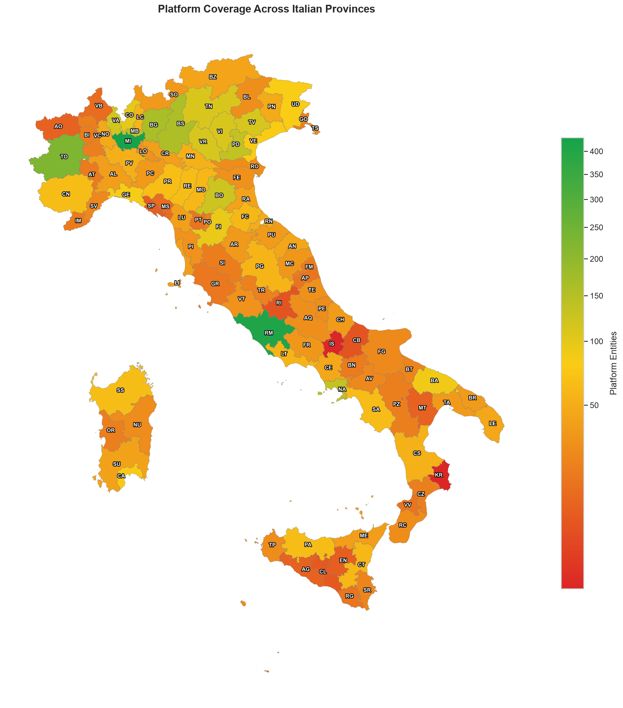
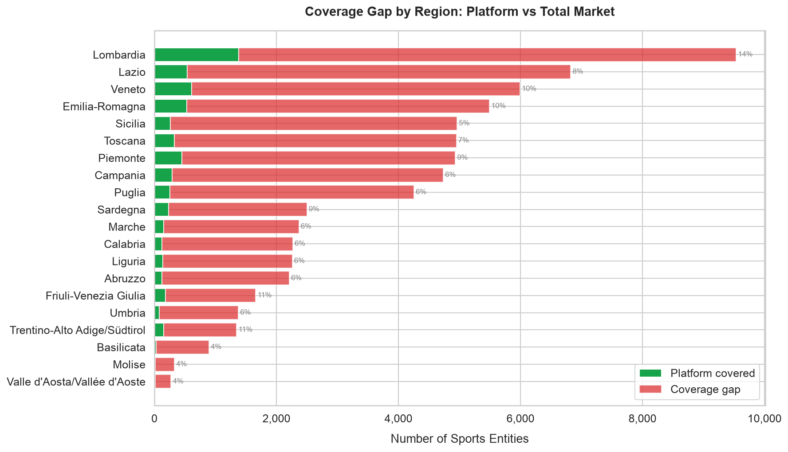
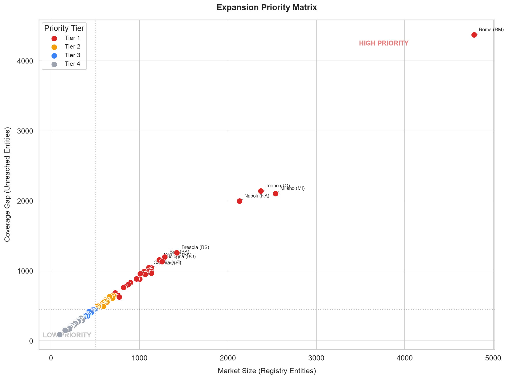

# Sports Market Compass <a href="#"></a> <a href="it/README.md"></a>


<!-- []-->
<!-- (https://codecov.io/gh/aleattene/sports-market-compass) -->

> A compass shows the direction: where, what and how much. Not the route.

---

An analysis of the Italian sports market built on two public sources:
- the official registry of sports clubs
- a software platform for sports club management.

Hence the fundamental question: of the whole Italian sports market,
how much is already served by the platform and how much is still to be served?

---

<br/>

## The analysis, in three acts

1. **Market size**: registry totals by province, i.e. how big each local
   market is.
2. **Coverage**: platform presence vs registry totals, the coverage gap
   province by province.
3. **Direction**: priority matrix and tiered ranking, where market size and
   gap width point together.

The notebook ([`01_coverage_gap_analysis.ipynb`](notebooks/01_coverage_gap_analysis.ipynb))
walks the full arc at EDA depth. The roadmap deepens the third act:
investability threshold, attractiveness score (size × gap × sport diversity ×
registration trend), parametric budget allocator (the amount is not collected
data but a free parameter, split across provinces in proportion to the score).

---

<br/>

## Project status

- [x] **Milestone 01**: coverage gap analysis (notebook, bilingual report,
  synthetic sample, data contract tests, CI)
- [ ] **Looker Studio dashboard alignment** to the current snapshot
  (expected in September 2026)
- [ ] **Milestone 02**: investability threshold and attractiveness score
- [ ] **Milestone 03**: parametric budget allocator

---

<br/>


## Key figures

<!-- *Rendered locally from a real collection (see the Data and privacy section).*-->

<br/>



<br/>



<br/>



<br/>

A more detailed analysis is available in the **report** and/or the **interactive dashboard**:

- [Executive Report](reports/REPORT.md).
- [Interactive dashboard (Looker Studio)](https://datastudio.google.com/s/tDAIpFPxjls)
*(being aligned to the current snapshot)*.

---

<br/>


## Data and privacy

This repository **contains no real dataset**:

- `reports/` (figures and report) is rendered by a
  private data collection pipeline, respectful of robots.txt and rate
  limiting, with sanitization at the source;
- `data_sample/` is **entirely synthetic**: real geography (province names
  and abbreviations are public facts), values auto-generated
  deterministically ([`generate_data_sample.py`](scripts/generate_data_sample.py), with a fixed seed);
- at runtime the notebook loads `data/` (your own data, gitignored) if
  present, otherwise it falls back on the sample: a fresh clone runs
  end-to-end.

---

<br/>

### Bring your own data

Place these files in `data/` (same schema as the sample):

| File | Columns / fields | Role |
|------|------------------|------|
| `registry_entity_counts_by_province.csv` | `region_id, region_name, province_id, province_name, province_abbr, entities_total` | market totals by province |
| `platform_entity_counts_by_province.csv` | `region_code, region_name, province_abbr, platform_entities` | coverage by province |
| `platform_entities.json` | `{dimension, retrieved_at, count, sport_areas[], items:[{sport[], registration_year, province_abbr, region_code}]}` | optional: enables the sport areas and trend sections |

The `sport` field carries **area-level values** (see the first method note).

---

<br/>

## Method notes and declared limits

- **Sport dimension at area granularity**. The source describes clubs with fine-grained, ever-evolving sport
labels; the collection pipeline, respecting data privacy, groups them into 16 areas
inspired by sports federations before export. Analysis, figures and the data contract use only the areas, i.e. a stable taxonomy independent
of the source, declared by the payload itself (`sport_areas`).

- **Sardinian province harmonization**. The platform keeps the province code in force when each club registered,
so the codes abolished by the 2016 reform (CI, OG, OT) coexist with the current ones.
They are remapped onto the succeeding provinces (CI into SU, OG into NU, OT into SS), that is onto the registry
layout at the snapshot date. One-way harmonization, from the platform toward the registry.

- **Declared limit**. Codes that survived 2016 (CA above all) cannot be verified below the province
level. The province is the finest granularity collected, privacy by design.
The upcoming reform will reassign SU/VS/OG/OT to new provinces: the map is versioned and will need revising
once the sources adopt the new layout (which is why no VS entry exists today).

- **Robust code parsing**. Napoli's abbreviation is literally `NA`: the CSV reads explicitly protect it
from being parsed as a missing value (pandas' default), which would make it silently vanish from merges and
labels.

---

<br/>

## Repository structure

```
sports-market-compass/
├── README.md                             # English (canonical); Italian version in /it
├── notebooks/
│   └── 01_coverage_gap_analysis.ipynb    # EDA notebook
├── reports/
│   ├── REPORT.md                         # commented analysis results (IT in reports/it/)
│   └── figures/                          # renders from a real collection (IT in figures/it/)
├── geo/                                  # province and region boundaries (public geodata)
├── data_sample/                          # synthetic sample (real geography, auto-generated values)
├── scripts/
│   └── generate_data_sample.py           # synthetic sample generator
├── tests/
│   └── test_data_contract.py             # data contract tests on the sample
├── data/                                 # real dataset (gitignored, optional)
├── requirements.txt                      # project dependencies
├── .github/
│   └── workflows/ci.yml                  # CI: hygiene, determinism, tests, notebook
└── .pre-commit-config.yaml               # nbstripout: notebook outputs never in history
```

---

<br/>

## Reproducibility

The notebook runs end-to-end even on a freshly downloaded clone: without
`data/` it uses the synthetic sample, no real data required. Prerequisites:
Git and Python 3.13+.

**1. Clone the repository and enter the folder**: downloads the project from
GitHub and moves the shell inside it.

```bash
git clone https://github.com/aleattene/sports-market-compass.git
cd sports-market-compass
```

**2. Create the virtual environment**: an isolated Python installation
dedicated to the project, so dependencies never touch the system.

```bash
python3 -m venv .venv      # macOS / Linux
py -3 -m venv .venv        # Windows
```

**3. Activate the environment**: from here on `python` and `pip` point to the
project environment (the prompt shows `(.venv)`).

```bash
source .venv/bin/activate      # macOS / Linux
.venv\Scripts\activate         # Windows (PowerShell: .venv\Scripts\Activate.ps1)
```

**4. Install the dependencies**: reads `requirements.txt` and installs the
libraries at the pinned versions.

```bash
pip install -r requirements.txt
```

**5. Install the pre-commit hook**: enables nbstripout, which automatically
strips notebook outputs at every commit.

```bash
pre-commit install
```

**6. Open the notebook**: launches Jupyter in the browser, directly on the
analysis notebook.

```bash
jupyter lab notebooks/01_coverage_gap_analysis.ipynb
```

The sample regenerates with `python scripts/generate_data_sample.py`
(deterministic: same seed, same output).

---

<br/>

### Author:
[Alessandro Attene](https://www.linkedin.com/in/aleattene)

#### License:
[MIT](LICENSE)
