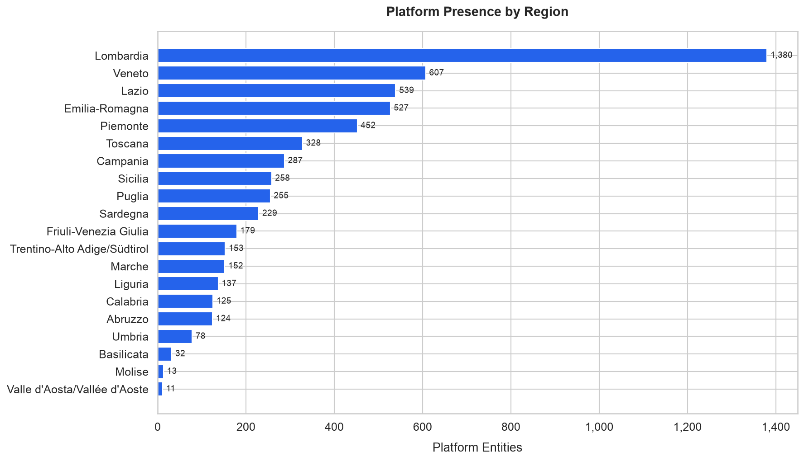
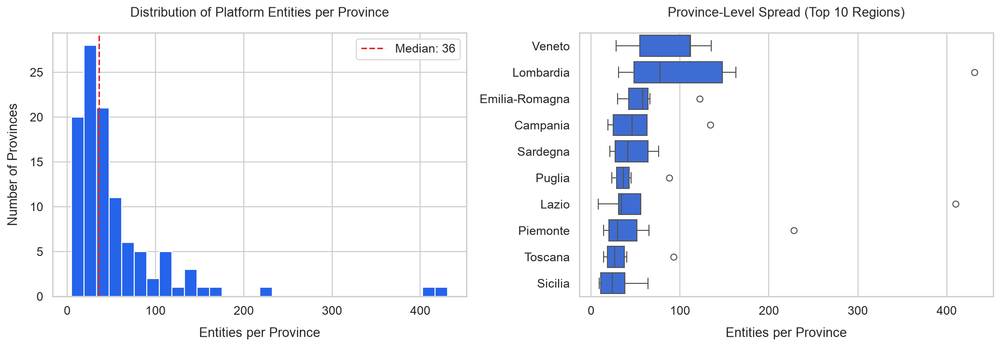
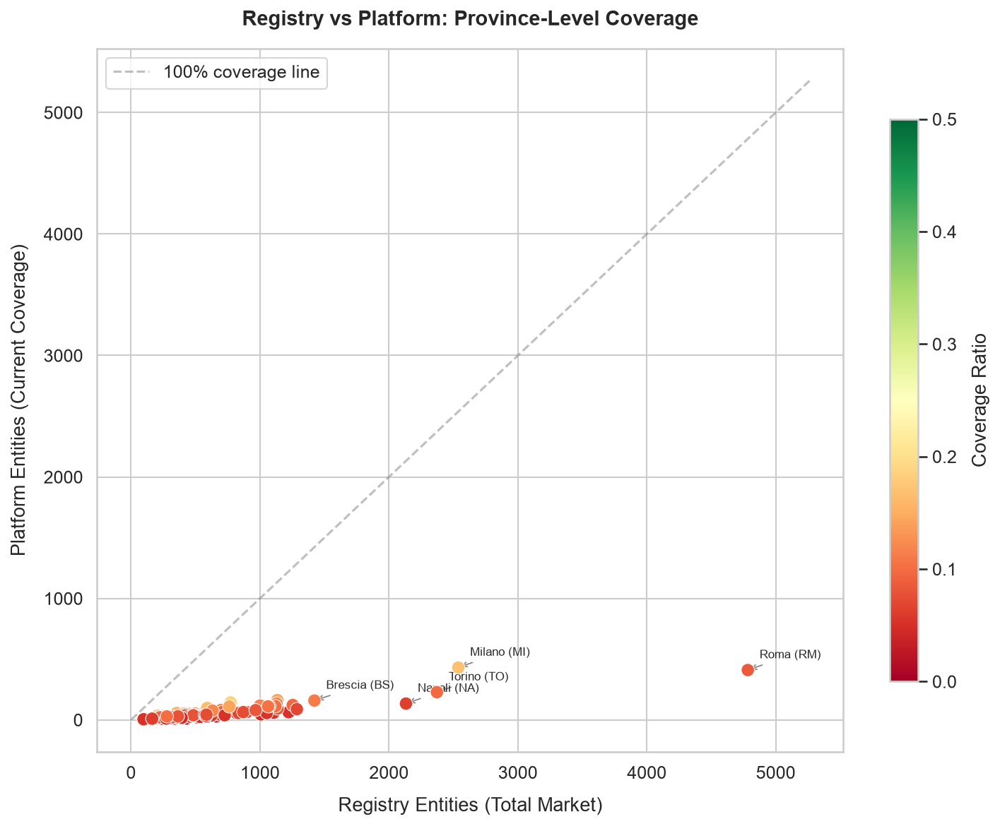
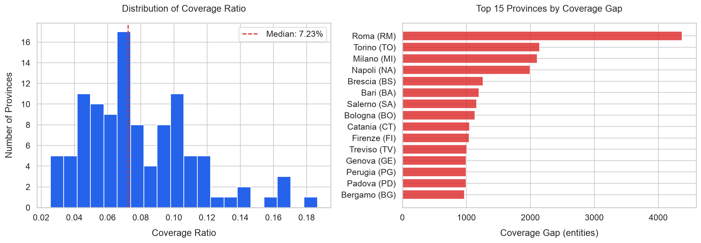
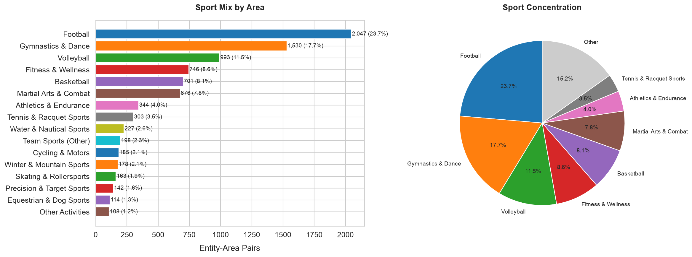
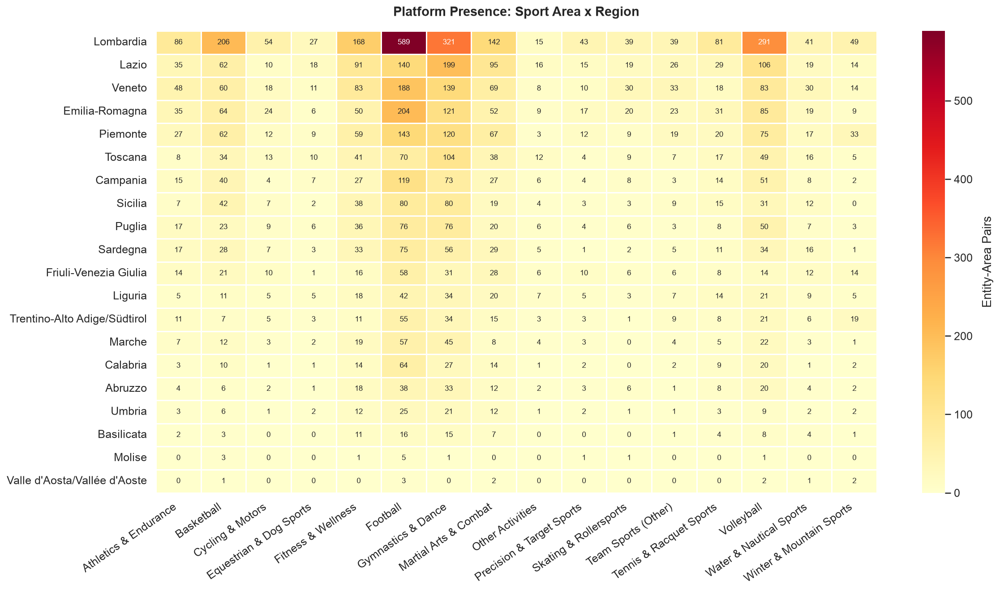
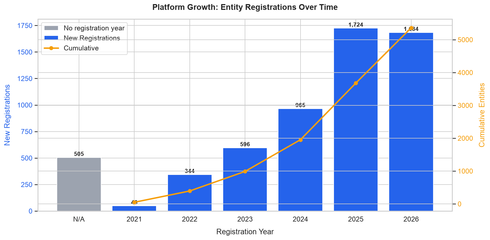
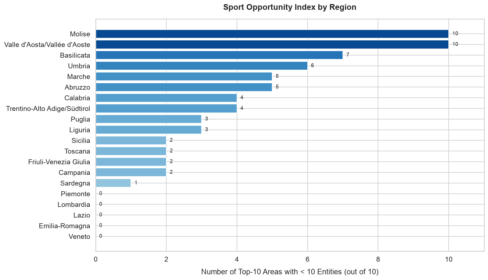

# Sports Market Compass • Executive Report    

## Executive Summary

- **Total addressable market:** the official sports registry counts **~70,000 registered entities** across all 107
Italian provinces (August 2026): on average ~650 per province, with Roma (4,783), Milano (2,538) and Torino (2,372)
leading.

- **Platform coverage:** the platform is used by **about 6,000 entities**, an overall coverage of **≈8.5%** of the
registered market. Coverage is highly uneven: the median province sits at 7.2%, with a range from 2.6% to 18.7%.

- **Coverage gap:** roughly **64,000 sports entities** are not served by the platform. The largest absolute gaps
concentrate in the largest urban areas: Roma (≈4,400 unreached entities), Torino, Milano, Napoli.

- **Recommended action:** a phased expansion targeting Tier 1 provinces (largest market and largest gap) is deemed
the highest-impact growth path.

---

## 1. Context and Objective

This analysis answers five key business questions for a sports management platform operating in Italy.
Each question is translated into its analytic approach, i.e. the metric and method that answer it in the data, with a
pointer to the section addressing it:

| Area | Business question | Analytic approach | Answer |
|------|-------------------|-------------------|--------|
| **Geographic expansion** | Where should the platform's expansion focus? | Province ranking by absolute gap and coverage ratio (official registry vs platform) | Sec. 3, 6 |
| **Sport-area opportunity** | Which sport areas hold the biggest untapped potential? | Sport mix by area and identification of under-represented areas | Sec. 4 |
| **Growth** | Is the platform growing? At what pace? | Registration trend by year, with cumulative view (survivor view, see note in Sec. 5) | Sec. 5 |
| **Expansion sequencing** | In what order should provincial markets be addressed? | Composite priority score (60% gap, 40% market size) and tier segmentation | Sec. 6 |
| **Opportunity size** | How much market remains to be won? | Unreached market quantification (registered entities − platform entities) | Sec. 3, 7 |

### Data Sources

| Source | Description | Granularity |
|--------|-------------|-------------|
| **Registry** | Official sports registry: total registered entities by province | Province (107) |
| **Platform** | Sports management platform: entities currently present | Province + Sport area + Year |

> **Privacy note:** platform raw data is sanitized and aggregated at collection time.
> No personal data is ever stored.

### Key KPIs

| KPI | Formula | Interpretation |
|-----|---------|----------------|
| **Coverage Ratio** | `platform_entities / entities_total` | 0 = no coverage, 1 = full coverage |
| **Coverage Gap** | `entities_total - platform_entities` | Absolute number of unreached entities |
| **Priority Score** | `0.6 × gap_score + 0.4 × density_score` | Composite expansion priority (0–1) |

The two derived scores composing the Priority Score:
- `gap_score` is the 0–1 normalization of the Coverage Gap: how much market is not yet covered;
- `density_score` is the 0–1 normalization of `entities_total`: how big the provincial market is overall.

The Priority Score therefore blends "how much market is missing" (60%) with "how big the market is" (40%).

---

## 2. Platform Geographic Distribution

Before analyzing the coverage gap, it is important to understand where the platform currently operates.

The platform is present in every Italian region, but concentration is highly uneven: Lombardia alone accounts for
roughly a quarter of platform entities, followed by Veneto and Lazio.
Within each region the distribution further skews toward the regional capital's province.

The histogram confirms a long-tail distribution: most provinces host relatively few entities, while a small number
concentrates a disproportionate share.

### Geographic Coverage Map

The choropleth offers an immediate geographic reading across all 107 provinces: green shades mark higher values,
yellow intermediate, red lower.
Coverage clearly concentrates in northern and central Italy, in particular the provinces of Roma and Milano, while
most of the south and the islands show a comparatively lower presence, reinforcing the priority framework of
Section 6.

---

## 3. Coverage Gap Analysis

Comparing the official registry (total addressable market, **~70,000** entities) with platform presence reveals the
size of the expansion opportunity for the platform itself: overall coverage stops at **≈8.5%**, leaving
**≈64,000 sports entities** unreached.

### Coverage Gap by Region

The stacked bars show each region's total market (green: covered, red: gap), with the coverage ratio annotated.
Lombardia is both the largest market (9,536 registered entities) and the best covered among large regions (14.5%).
At the other end, Sicilia sits at 5.2% despite a far-from-small market (4,961 registered entities), while Basilicata
(3.6%) and Molise (4.0%) combine small markets with minimal presence.

### Registry vs Platform: Province-Level View

Each province sits on a market-size vs platform-presence plane; the dashed diagonal is 100% coverage.
The clustering near the x-axis confirms that almost every province is far from full coverage.
Milano stands out as the best-covered large market (17.0%), Roma as the largest one still mostly unreached (8.6%).

### Coverage Ratio Distribution

The distribution of provincial coverage ratios is narrow and low: median 7.2%, minimum 2.6%, maximum 18.7%. No
province is even one-fifth (20%) covered.
The right panel ranks the top 15 provinces by absolute gap, led by Roma (≈4,400), Torino (≈2,100), Milano (≈2,100)
and Napoli (≈2,000): the highest-priority expansion targets.

---

## 4. Sport-Area Analysis

The sport dimension is published at **area granularity**: 16 federation-inspired areas,
assigned by the collection pipeline before the data reaches this analysis.
About 24% of entities span multiple areas; area totals therefore count *entity-area pairs* (an entity counts once
per area it covers).

### Sport Mix and Concentration

Football is the leading area, present in ~35% of platform entities, followed by Gymnastics & Dance (~26%) and
Volleyball (~17%). The top 3 areas concentrate **over half of all entity-area pairs**: a solid commercial foothold,
but a poorly diversified portfolio.
Areas such as Athletics & Endurance, Water & Nautical Sports and Winter & Mountain Sports are under-represented
segments with expansion potential.

### Sport Area × Region Heatmap

The heatmap shows the depth of coverage by area and region: Lombardia, Veneto and Lazio lead almost everywhere,
while several regions pair a solid overall presence with near-empty cells in specific areas: targeted growth
opportunities.

---

## 5. Growth Trajectory

Among the entities with a registration year (91% of the total), the observed series starts in 2021 and accelerates
sharply: **nearly two-thirds registered in the last two observed years**, and the partial 2026 (snapshot in August)
already matches the full 2025 volume. The cumulative line runs over the dated series only: its endpoint is the
current stock of entities with a known year.

> **Survivor view, declared limit:** the chart is the distribution of the entities *currently served* by registration
> year. Registrations later followed by churn are not observable. Entities without a year (9%) appear as a separate
> "N/A" bar, outside the time series and the cumulative line: they are most likely earlier joins predating the
> observed series, whose original year is not tracked in the data.

---

## 6. Expansion Opportunity

### Priority Framework

| Factor | Weight | Rationale                                          |
|--------|--------|----------------------------------------------------|
| **Gap Score** | 60% | Larger gap: more unreached entities           |
| **Density Score** | 40% | Larger market: higher absolute opportunity |

Provinces are scored and assigned to four priority tiers:
- Tier 1: top priority
- Tier 2: medium priority
- Tier 3: low priority
- Tier 4: minimal priority.

In the exported datasets the stable tier identifier is `Tier 1`..`Tier 4`; the Italian figures render it as
"Livello 1".."Livello 4" (same classification, translated at display time only).

### Priority Matrix

The top-right quadrant (large market and large gap) holds the most impactful targets.
The Tier 1 group is led by **Roma, Milano, Torino, Napoli and Brescia**: provinces where thousands of sports
entities are not yet served by the platform.

### Sport Opportunity by Region

For each region, the chart counts how many of the top-10 sport areas covered by this analysis have fewer than 10
entities served by the platform. It is an indicator of under-served segments.
Regions with high scores are candidates for sport-area deepening on top of geographic expansion.

### Recommended Expansion Strategy

| Phase | Focus | Criteria                                                                 |
|-------|-------|--------------------------------------------------------------------------|
| **Phase 1** | Geographic expansion | Tier 1 provinces: largest market and largest gap                |
| **Phase 2** | Sport-area deepening | Add under-represented sport areas in existing regions |
| **Phase 3** | Long-tail expansion | Tier 2 provinces: medium market, moderate gap                    |

---

## 7. Conclusions

1. **Market sizing:** the registry counts ~70,000 sports entities across 107 provinces; a handful of provinces
concentrate both most of the market and most of the platform's activity.

2. **Coverage gap:** at ≈8.5% overall coverage of the total market, roughly 64,000 sports entities remain unreached.
The gap is largest exactly where the market is largest.

3. **Sport concentration:** over half of all entity-area pairs belong to just three of the sixteen areas: Football,
Gymnastics & Dance and Volleyball. This is a strength (the platform holds the most populous areas of the market) but
also a dependency: across the other thirteen areas the presence is still thin and growth is yet to be built.

4. **Growth trajectory:** observed registrations accelerate year after year (within the declared survivor-view
limit), signaling positive momentum into 2026 as well.

5. **Expansion opportunity:** the priority framework points to Tier 1 provinces (Roma, Milano, Torino, Napoli,
Brescia) as the highest-impact first wave of a phased growth strategy.

---

## 8. Interactive Dashboard

Explore the data interactively on Looker Studio:

[Open the Looker Studio Dashboard](https://datastudio.google.com/s/tDAIpFPxjls)

> Note: the dashboard currently reflects an earlier snapshot of the analysis and is being aligned to the present
> one. A Google account may be required.

---

## 9. Data, Methodology and Declared Limits

This repository distributes the analysis, not the data: figures and this report are rendered locally from a real
collection of the two public sources (snapshot: August 2026); the committed `data_sample/` is instead fully
synthetic.

To reproduce the analysis on your own collection, place these files in `data/` (schema in the [README](../README.md)):

| File | Role |
|------|------|
| `data/registry_entity_counts_by_province.csv` | market totals by province |
| `data/platform_entity_counts_by_province.csv` | platform presence by province |
| `data/platform_entities.json` | entity-level export (areas, year, province) |

Geographic boundaries ship with the repository under `geo/`.

The full exploratory analysis is in [`notebooks/01_coverage_gap_analysis.ipynb`](../notebooks/01_coverage_gap_analysis.ipynb).

**Method notes and declared limits:**

- **Sardinian province harmonization**. The dataset carries province codes from layouts abolished by the 2016 reform
(CI, OG, OT); they are remapped one-way onto the registry layout at the snapshot date (CI into SU, OG into NU,
OT into SS). Codes that survived 2016 (CA above all) cannot be verified below the province level: the province is
the finest granularity collected, privacy by design. The incoming province reform will reassign these codes: the map
is versioned and will need revising.

- **Robust code parsing**. Napoli's abbreviation is literally `NA`: CSV reads explicitly prevent it from being
parsed as a missing value, which would silently drop the province from merges.

- **Anonymous sources**. The two public sources are deliberately never named, neither in the report nor in the code.
The collection pipeline respects robots.txt and rate limiting, and sanitizes data at the source.

---

## Appendix: Analysis Outputs

Generated locally by the notebook under `data/analysis/` (gitignored):

| File | Description                                                         |
|------|---------------------------------------------------------------------|
| `coverage_gap_by_province.csv` | Registry and platform merged at province level, with gap and ratio |
| `expansion_priority_by_province.csv` | Provinces ranked by priority score, with tiers            |
| `platform_sport_by_region.csv` | Entity-area pairs aggregated by region and sport area           |
