# Sports Market Compass • Report Esecutivo  

## Sintesi Esecutiva

- **Mercato totale indirizzabile:** il registro sportivo ufficiale conta **~70.000 società registrate** in tutte le 107
province italiane (agosto 2026): in media ~650 per provincia, con Roma (4.783), Milano (2.538) e Torino (2.372) in
testa.

- **Copertura della piattaforma:** la piattaforma è utilizzata da **circa 6.000 società**, una copertura complessiva
dell'**≈8,5%** rispetto al mercato registrato. La copertura è molto disomogenea: la provincia mediana infatti è al
7,2%, con un range dal 2,6% al 18,7%.

- **Gap di copertura:** circa **64.000 società sportive** non sono servite dalla piattaforma. I gap assoluti maggiori
si concentrano nelle aree urbane più grandi: Roma (≈4.400 società non raggiunte), Torino, Milano, Napoli.

- **Azione raccomandata:** un'espansione per fasi mirata alle province di Livello 1 (mercato più ampio e gap più ampio)
si ritiene essere il percorso di crescita a maggiore impatto.

---

## 1. Contesto e Obiettivo

Questa analisi risponde a cinque domande di business chiave per una piattaforma di gestione sportiva operante in Italia.
Ogni domanda è tradotta nel suo approccio analitico, cioè la metrica e il metodo con cui trova risposta nei dati, con il
rimando alla sezione che la affronta:

| Area | Domanda di business | Approccio analitico | Risposta |
|------|---------------------|---------------------|----------|
| **Espansione geografica** | Dove dovrebbe concentrarsi l'espansione della piattaforma? | Classifica delle province per gap assoluto e tasso di copertura (registro ufficiale vs piattaforma) | Sez. 3, 6 |
| **Opportunità per area sportiva** | Quali aree sportive offrono il maggiore potenziale inespresso? | Mix sportivo per area e individuazione delle aree sotto-rappresentate | Sez. 4 |
| **Crescita** | La piattaforma sta crescendo? A che ritmo? | Trend delle registrazioni per anno, con vista cumulata (survivor view, v. nota in Sez. 5) | Sez. 5 |
| **Sequenza di espansione** | In che ordine affrontare i mercati provinciali? | Punteggio composito di priorità (60% gap, 40% dimensione mercato) e segmentazione in livelli | Sez. 6 |
| **Dimensione dell'opportunità** | Quanto mercato resta da conquistare? | Quantificazione del mercato non raggiunto (società registrate − società in piattaforma) | Sez. 3, 7 |

### Fonti dei Dati

| Fonte | Descrizione | Granularità |
|-------|-------------|-------------|
| **Registro** | Registro sportivo ufficiale: totale società registrate per provincia | Provincia (107) |
| **Piattaforma** | Piattaforma di gestione sportiva: società attualmente presenti | Provincia + Area sportiva + Anno |

> **Nota privacy:** i dati grezzi della piattaforma vengono sanitizzati e aggregati al momento della raccolta.
> Nessun dato personale viene mai memorizzato.

### KPI Principali

| KPI | Formula | Interpretazione |
|-----|---------|-----------------|
| **Tasso di Copertura** | `platform_entities / entities_total` | 0 = nessuna copertura, 1 = copertura totale |
| **Gap di Copertura** | `entities_total - platform_entities` | Numero assoluto di società non raggiunte |
| **Punteggio Priorità** | `0.6 × gap_score + 0.4 × density_score` | Priorità composita di espansione (0–1) |

I due punteggi derivati che compongono il Punteggio Priorità:
- `gap_score` è la normalizzazione 0–1 del Gap di Copertura: quanta parte di mercato non è ancora coperta;
- `density_score` è la normalizzazione 0–1 di `entities_total`: quanto è grande il mercato provinciale nel suo complesso.

Il Punteggio Priorità combina quindi: "quanto mercato manca" (60%) con "quanto è grande il mercato" (40%).

---

## 2. Distribuzione Geografica della Piattaforma

Prima di analizzare il gap di copertura è importante capire dove opera attualmente la piattaforma.

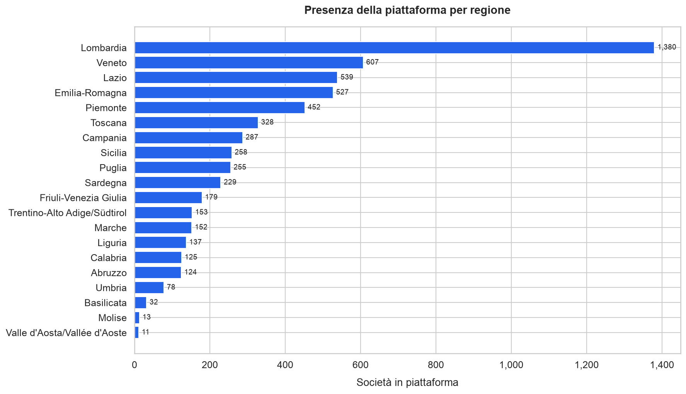

La piattaforma è presente in tutte le regioni italiane, ma la concentrazione è molto disomogenea: la sola Lombardia
vale circa un quarto delle società in piattaforma, seguita da Veneto e Lazio.
All'interno di ciascuna regione la distribuzione è ulteriormente sbilanciata verso la provincia del capoluogo.

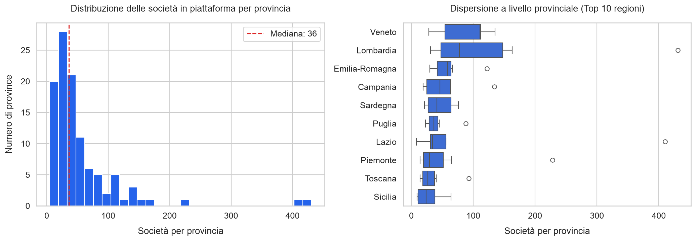

L'istogramma conferma una distribuzione a coda lunga: la maggior parte delle province ospita relativamente poche
società, mentre un numero ridotto ne concentra una quota sproporzionata.

### Mappa Geografica di Copertura

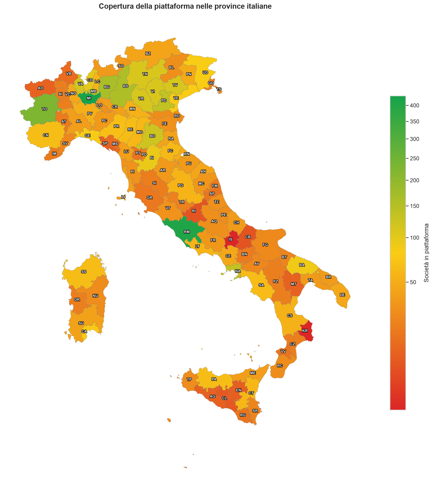

La coropletica offre una lettura geografica immediata su tutte le 107 province: le tonalità di verde indicano valori
più alti, il giallo intermedi, il rosso più bassi.
La copertura si concentra evidentemente nel nord e nel centro Italia, in particolare nelle province di Roma e Milano,
mentre gran parte del sud e le isole mostrano una presenza comparativamente più bassa, a rafforzare il framework di
priorità della Sezione 6.

---

## 3. Analisi del Gap di Copertura

Il confronto tra il registro ufficiale (mercato totale indirizzabile, **~70.000** società) e la presenza della piattaforma
rivela la dimensione dell'opportunità di espansione per la piattaforma stessa: la copertura complessiva si ferma
a **≈8,5%**, lasciando **≈64.000 società sportive** non raggiunte.

### Gap di Copertura per Regione

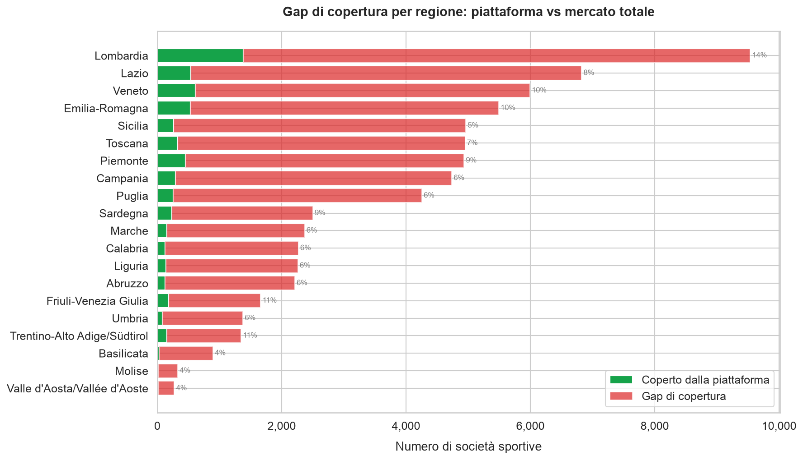

Le barre impilate mostrano il mercato totale di ciascuna regione (verde: coperto, rosso: gap), con il tasso di copertura
annotato.
La Lombardia è contestualmente il mercato più grande (9.536 società registrate) e il meglio coperto tra le grandi
regioni (14,5%). All'estremo opposto, la Sicilia è al 5,2% nonostante un mercato tutt'altro che piccolo (4.961 società
registrate), mentre Basilicata (3,6%) e Molise (4,0%) uniscono mercati ridotti e presenza minima.

### Registro vs Piattaforma: Vista a Livello Provinciale

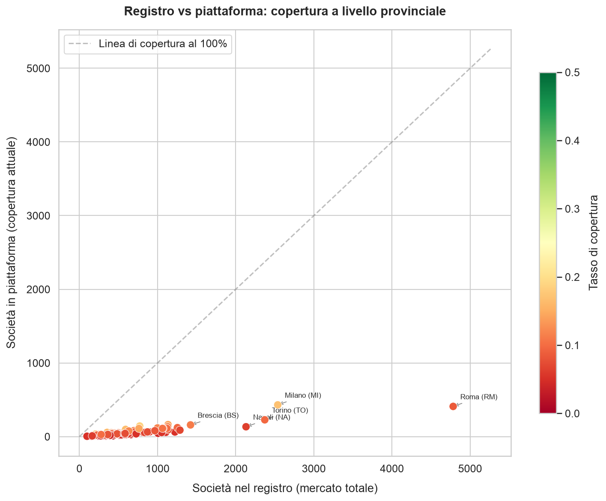

Ogni provincia è posizionata sul piano dimensione del mercato vs presenza della piattaforma; la diagonale tratteggiata
è la copertura al 100%.
L'addensamento dei punti vicino all'asse x conferma che quasi tutte le province sono lontane dalla copertura piena.
Milano spicca come il grande mercato meglio coperto (17,0%), Roma come il più grande ma ancora in gran parte non
raggiunto (8,6%).

### Distribuzione del Tasso di Copertura

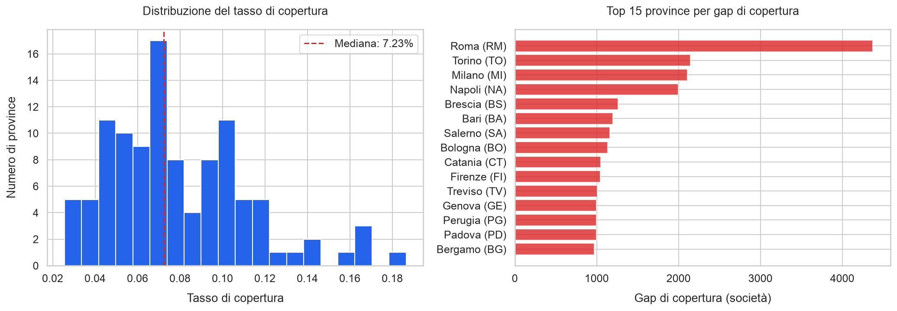

La distribuzione dei tassi provinciali è stretta e bassa: mediana 7,2%, minimo 2,6%, massimo 18,7%. Nessuna provincia
è coperta nemmeno per un quinto (20%).
Il pannello di destra ordina le prime 15 province per gap assoluto, guidate da Roma (≈4.400), Torino (≈2.100),
Milano (≈2.100) e Napoli (≈2.000): i target di espansione a più alta priorità.

---

## 4. Analisi per Area Sportiva

La dimensione sport è pubblicata a **granularità di area**: 16 aree ispirate alle federazioni sportive,
assegnate dalla pipeline di raccolta prima che i dati arrivino a questa analisi.
Circa il 24% delle società copre più aree; i totali per area contano quindi *coppie società-area* (una società conta
una volta per ciascuna area coperta).

### Mix Sportivo e Concentrazione

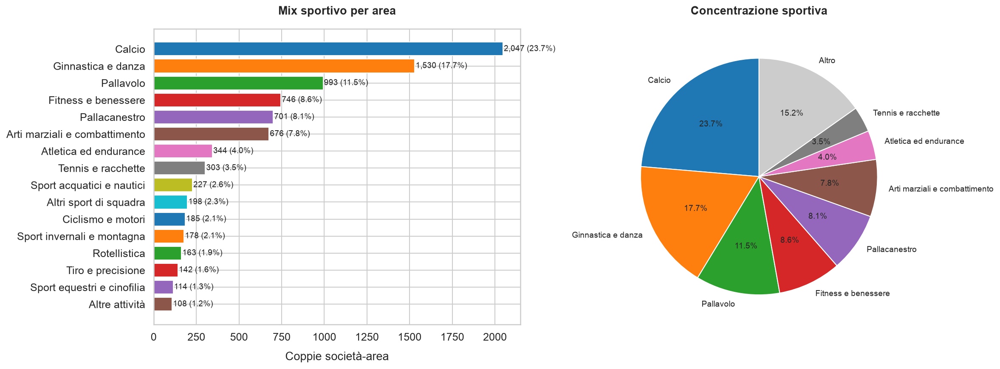

Il Calcio è l'area principale, presente in ~35% delle società in piattaforma, seguito da Ginnastica e danza (~26%) e
Pallavolo (~17%). Le prime 3 aree concentrano **oltre la metà di tutte le coppie società-area**: un presidio
commerciale solido, ma anche un portafoglio poco diversificato.
Aree come Atletica ed endurance, Sport acquatici e nautici, Sport invernali e montagna sono segmenti sotto-rappresentati
con potenziale di espansione.

### Heatmap Area Sportiva × Regione

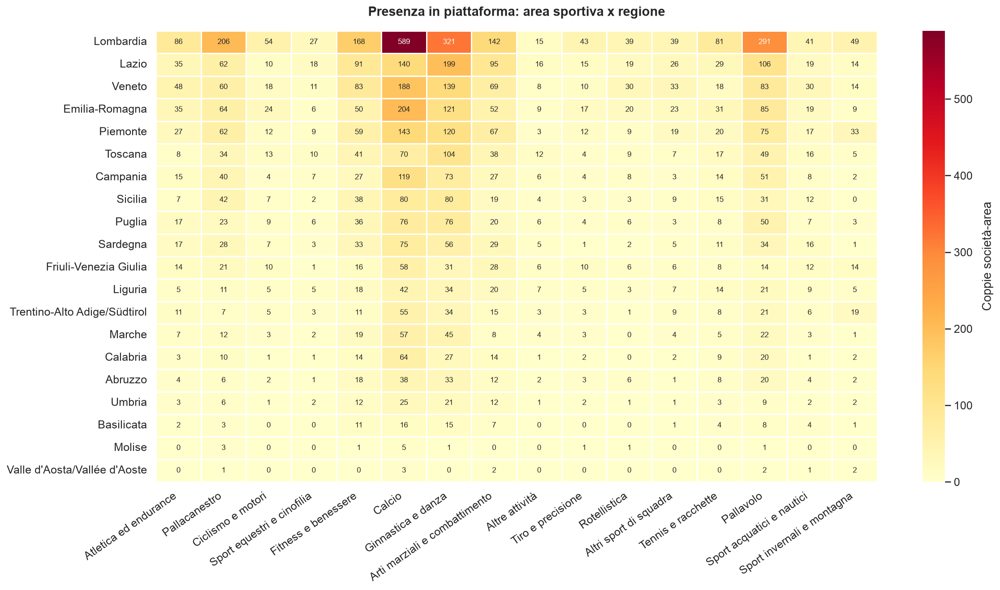

La heatmap mostra la profondità della copertura per area e regione: Lombardia, Veneto e Lazio guidano quasi ovunque,
mentre diverse regioni affiancano a una presenza complessiva solida celle quasi vuote in aree specifiche: opportunità
di crescita mirate.

---

## 5. Traiettoria di Crescita

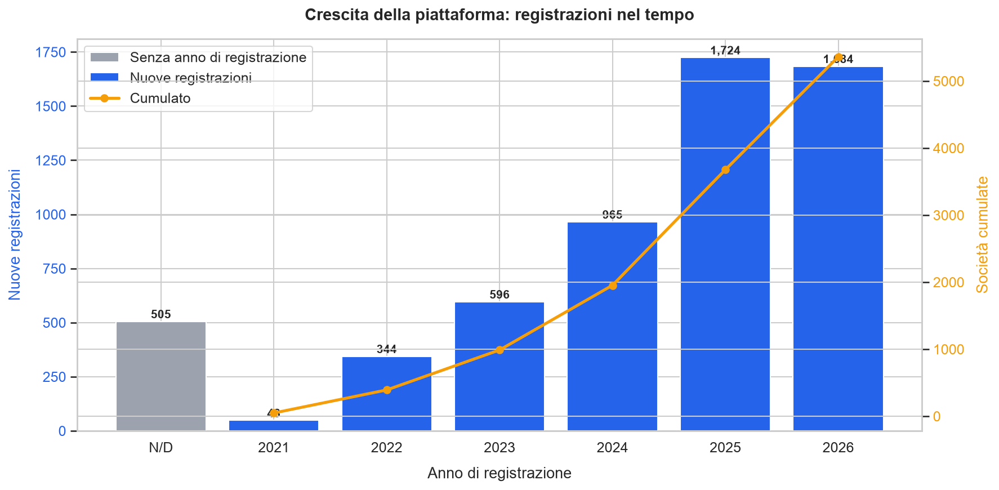

Tra le società con anno di registrazione valorizzato (91% del totale), la serie osservata parte dal 2021 e accelera
nettamente: **quasi due terzi si sono registrate negli ultimi due anni osservati**, e il 2026 parziale (snapshot ad
agosto) eguaglia già il volume dell'intero 2025. La linea cumulata percorre la sola serie datata: il suo punto
d'arrivo è lo stock attuale delle società con anno noto.

> **Survivor view, limite dichiarato:** il grafico è la distribuzione delle società *attualmente servite* per anno di
> registrazione. Le registrazioni cui hanno fatto seguito delle rinunce non sono osservabili. Le società senza anno
> (9%) compaiono come barra separata "N/D", fuori dalla serie temporale e dalla linea cumulata: si tratta
> verosimilmente di adesioni antecedenti all'avvio della serie osservata, il cui anno di origine non è tracciato nei
> dati.

---

## 6. Opportunità di Espansione

### Framework di Priorità

| Fattore | Peso | Razionale                                          |
|---------|------|----------------------------------------------------|
| **Gap Score** | 60% | Gap più ampio: più società non raggiunte           |
| **Density Score** | 40% | Mercato più ampio: maggiore opportunità assoluta |

Le province vengono valutate e assegnate a quattro livelli di priorità:
- Livello 1: priorità massima
- Livello 2: priorità media
- Livello 3: priorità bassa
- Livello 4: priorità minima.

Nei dataset esportati l'identificatore stabile dei livelli è `Tier 1`..`Tier 4`; le figure in italiano lo mostrano
come "Livello 1".."Livello 4" (stessa classificazione, tradotta solo in visualizzazione).

### Matrice di Priorità

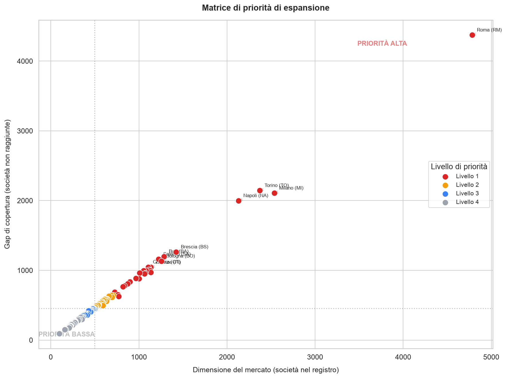

Il quadrante in alto a destra (mercato ampio e gap ampio) contiene i target a maggiore impatto.
Il gruppo di Livello 1 è guidato da **Roma, Milano, Torino, Napoli e Brescia**: province dove migliaia di società
sportive non sono ancora servite dalla piattaforma.

### Opportunità Sportiva per Regione

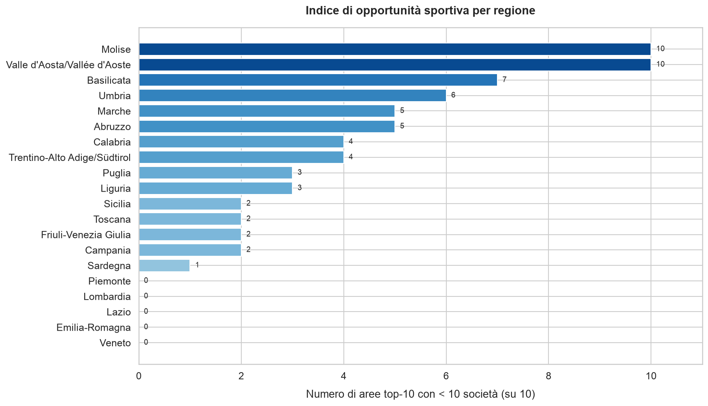

Per ciascuna regione il grafico conta quante delle prime 10 aree sportive oggetto di questa analisi hanno meno di 10
società sportive servite dalla piattaforma. Si tratta di un indicatore dei segmenti sotto-serviti.
Le regioni con punteggi alti sono candidate all'approfondimento per area, oltre che all'espansione geografica.

### Strategia di Espansione Raccomandata

| Fase | Focus | Criteri                                                                 |
|------|-------|-------------------------------------------------------------------------|
| **Fase 1** | Espansione geografica | Province di Livello 1: mercato più ampio e gap più ampio                |
| **Fase 2** | Approfondimento per area | Aggiungere le aree sportive sotto-rappresentate nelle regioni esistenti |
| **Fase 3** | Espansione long-tail | Province di Livello 2: mercato medio e gap moderato                    |

---

## 7. Conclusioni

1. **Dimensionamento del mercato:** il registro conta ~70.000 società sportive suddivise in 107 province; poche
province concentrano sia la maggior parte del mercato che la maggior parte dell'attività della piattaforma.

2. **Gap di copertura:** con una copertura complessiva dell'≈8,5% del mercato totale, circa 64.000 società sportive
restano non raggiunte. Il gap è massimo proprio dove il mercato è più grande.

3. **Concentrazione sportiva:** oltre la metà delle coppie società-area appartiene a sole tre aree su sedici: Calcio,
Ginnastica e danza e Pallavolo. È un punto di forza (la piattaforma presidia le aree più popolose del mercato) ma anche
una dipendenza: nelle altre tredici aree la presenza è ancora sottile e la crescita è tutta da costruire.

4. **Traiettoria di crescita:** le registrazioni osservate accelerano di anno in anno (pur nel limite dichiarato della
survivor view), segnalando uno slancio positivo anche per il 2026.

5. **Opportunità di espansione:** il framework di priorità indica le province di Livello 1 (Roma, Milano, Torino,
Napoli, Brescia) come prima ondata a maggiore impatto di una strategia di crescita per fasi.

---

## 8. Dashboard Interattiva

Esplora i dati in modo interattivo su Looker Studio:

[Apri la Dashboard Looker Studio](https://datastudio.google.com/s/tDAIpFPxjls)

> Nota: la dashboard riflette attualmente uno snapshot precedente dell'analisi ed è in corso di allineamento a quello
> presente. Potrebbe essere richiesto un account Google.

---

## 9. Dati, Metodologia e Limiti Dichiarati

Questo repository distribuisce l'analisi, non i dati: figure e report sono renderizzati in locale da una raccolta reale
delle due fonti pubbliche (snapshot: agosto 2026); il `data_sample/` committato è invece interamente sintetico.

Per riprodurre l'analisi su una propria raccolta, posizionare questi file in `data/` (schema nel [README](../../it/README.md)):

| File | Ruolo |
|------|-------|
| `data/registry_entity_counts_by_province.csv` | totali di mercato per provincia |
| `data/platform_entity_counts_by_province.csv` | presenza della piattaforma per provincia |
| `data/platform_entities.json` | export a livello di società (aree, anno, provincia) |

I confini geografici sono inclusi nel repository sotto `geo/`.

L'analisi esplorativa completa è in [`notebooks/01_coverage_gap_analysis.ipynb`](../../notebooks/01_coverage_gap_analysis.ipynb).

**Note di metodo e limiti dichiarati:**

- **Armonizzazione province sarde**. Nel dataset sono presenti sigle provinciali di assetti aboliti dalla riforma
del 2016 (CI, OG, OT); vengono rimappate a senso unico sull'assetto del registro alla data dello snapshot (CI in SU,
OG in NU, OT in SS). Le sigle sopravvissute al 2016 (CA in primis) non sono verificabili sotto il livello provinciale:
la provincia è la granularità più fine raccolta, privacy by design. La riforma provinciale in arrivo riassegnerà queste
sigle: la mappa è versionata e andrà rivista.

- **Parsing robusto dei codici**. La sigla di Napoli è letteralmente `NA`: le letture CSV impediscono esplicitamente
che venga interpretata come valore mancante, cosa che farebbe sparire la provincia dai merge in silenzio.

- **Fonti anonime**. Le due fonti pubbliche non vengono deliberatamente mai nominate, né nel report né nel codice.
La pipeline di raccolta rispetta robots.txt e rate limiting, e sanitizza i dati alla fonte.

---

## Appendice: Output dell'Analisi

Generati in locale dal notebook sotto `data/analysis/` (gitignored):

| File | Descrizione                                                         |
|------|---------------------------------------------------------------------|
| `coverage_gap_by_province.csv` | Registro e piattaforma uniti a livello provinciale, con gap e tasso |
| `expansion_priority_by_province.csv` | Province ordinate per punteggio di priorità, con livelli            |
| `platform_sport_by_region.csv` | Coppie società-area aggregate per regione e area sportiva           |
